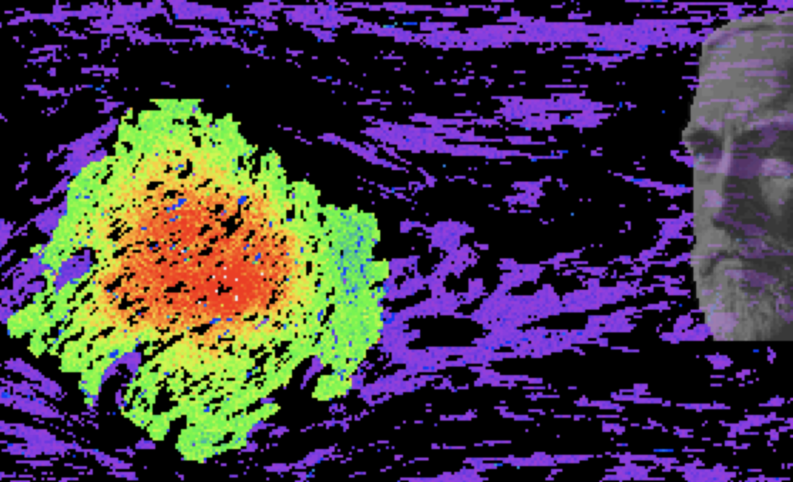
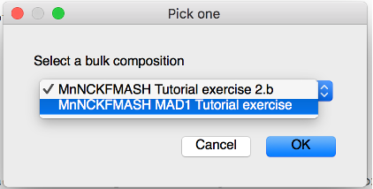
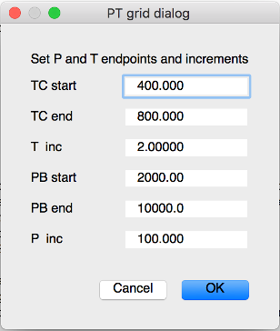

# Program Gibbs3

MAD Tutorial using programs Gibbs3 and MADPlotter3
-----

**by: Frank S. Spear & Adrian Castro**

<!--Replace file path-->

### Tutorial on making MADs (aka Mineral Assemblage Diagrams or Pseudosections)

#### Updated: October 2021

**Frank S. Spear & Adrian E. Castro**

**Department of Geology, Rensselaer Polytechnic Institute, Troy, New York 12180**

<spearf@rpi.edu>

### _Introduction_

This tutorial provides step-by-step instructions for the calculation of a Mineral Assemblage Diagram (MAD), also known as a pseudosection. General considerations about Program Gibbs3 are discussed in the Gibbs Reference Manual.

<!--Replace later? -->
Note that user inputs are shown in BOLD. Program output is shown in Courier font.

Handy hint: The program generates fairly large output files – 3 for each MAD. You can delete the `.log` file and the file with no extension. Keep the `.All` file – it contains the results you want.

You also need a good text editor to view these. On a Macintosh, BBEdit or Atom work well. You can get BBEdit from [BareBones Software](http://www.barebones.com/) and Atom from [Atom.io](https://atom.io/).

-----

**Exercise MAD 1: Calculation of a MAD for a typical pelite**

***Starting the program***

On startup, `Gibbs` displays a list of available thermodynamic datasets. For this tutorial, the only datasets that are available are

	Thermodynamic data files in Gibbs.fig file:
	1 SPaC18_Thermo.dat 
	2 SPaC18+TE_Thermo.dat 
	3 HP11_ds62_DQF.dat 
	4 HP98_ds55.dat 
	Pick thermodynamic data file to use in this session

**Choose:** `1  SPaC18_Thermo.dat`

Next, `Gibbs` will display a list of bulk composition files to choose from. 

	1 BR_Coticule.txt                 
	2 BR_BulkRockAnalyses.txt         
	3 BR_CVS_BulkRockAnalyses.txt     
	4 BR_TE_BulkRockAnalyses.txt      
	5 BR_EBC_Project_BulkRock.txt     
	6 BR_Cyclades.txt                 
	7 BR_Ios.txt                      
	8 BR_Syros.txt                    
	Pick the bulk composition file you wish to use
	
**Choose:** `2 BR_BulkRockAnalyses.txt`

***The Main menu***

The main menu will then appear:

	***********************************
	Thermo file: SPaC18_Thermo.dat 
	Newton's method
	***********************************
	MAIN MENU OPTIONS:
	1 = Begin/save problem
	-----------------------------
	2 = Single steps
	3 = Contour X-Y diagrams
	4 = MAD modeling (Pseudosection)
	-----------------------------
	8 = Go to global menu
	9 = Plotting menu
	11 = Thermodynamic data menu
	-----------------------------
	-----------------------------
	CHOOSE OPTION

**Choose:** `4 = MAD modeling (Pseudosection)`

	=====================================
	Newton's method; Mass balance = OFF
	=====================================
	Tangent menu 
	0 = return
	---------------------------
	1 = Pick a bulk composition
	2 = Choose minerals to consider
	3 = Pick P&T grid to examine
	---------------------------
	4 = Auto calc
	41 = Find stable assemblage at T&P
	42 = Auto calc (new algorithm)
	44 = Auto calc with fractionation
	5 = Pick a P&T and calc (debug mode)
	25 = New -- Pick a P&T and calc (debug mode)
	---------------------------
	Other Pseudosection routines
	6 = Turn log file on or off
	7 = Call Printt
	8 = Call GLOBAL
	9 = Set plotting axes
	10 = Gibbs/Newton switch
	------Debug----------------
	11 = Calculate affinity file
	(this replaces the OverstepGarnet routines by calculating all affinities on the P-T grid)
	12 = Grow garnet in overstepped environment with fixed assemblage and garnet fractionation
	13 = Affinity node nucleation calculations
	14 = Grow garnet in equilibrium with fractionation along a path
	15 = Check out activity calculation for HP dataset
	16 = Speed test
	17 = Grow garnet in OS environment (PT path) with assemblage evolution and garnet fractionation
	18 = Calculate tangent function for debugging
	19 = Grow garnet in OS environment (constant P&T) with assemblage evolution and garnet fractionation
	---------------------------
	20 = Jacob"s ladder
	21 = Calculate EBC for garnet core composition OS model -- requires P&T of nucleation (3 elements)
	22 = Calculate EBC for garnet core composition EQ or OS model -- requires P&T of nucleation (2 elements)
	23 = Calculate EBC for garnet core composition EQ or OS model -- requires P&T of nucleation (4 elements)
	25 = Debug routine
	---------------------------
	30 = Make parser conversion file for this MIF and thermo data file
	-2 = Set global output length
	
The “basic” MAD is created using options `(1), (2), (3)`, and `(41), (42)` in that order. 

***Choosing a Bulk Composition***

**Choose:** `1 = Pick a bulk composition`

A drop-down box will appear with all of the bulk rock analyses contained in the file
`Gibbs_Essentials/BR_BulkRockAnalyses.txt`

This is the bulk rock analyses file selected when the program started. It is in ASCII and can be edited by the user to add bulk rock analyses. See notes in the Gibbs Reference Manual for more details on the format of this file. 

<!--Replace file path-->

**Choose:** `“MnNCKFMASH MAD1 Tutorial exercise”`

***A note on bulk composition files:*** When you analyze a rock and determine the amount of H2O present, you are only getting the H2O that is in the rock today, not when the rock was a wet sediment. In general, you will want H2O to be present in excess at the lowest metamorphic grades. To ensure this happens, add sufficient H2O to the bulk rock analyses – usually a value of 10 (wt%) is sufficient. When you run the MAD you should check to see that all assemblages contain H2O. There may be a lot of H2O (like 10-20 volume %), but this doesn’t change the phase relations.

***One caveat:*** If you are examining melting relations, the amount of melt produced at the solidus is highly dependent on the amount of H2O present. With 10% H2O in your bulk rock analysis you are likely to get vapor-saturated melting under most PT conditions. This may (or may not) be what you want. But don’t despair – there is an option when you run the MAD to keep the porosity of the rock constant, and the program does this by expelling H2O at every step (more on this below).

***Choosing a MIF***

Choosing a bulk composition file will return you to the main MAD menu.

This rock is a metapelite, so we want to examine only minerals in the pelitic system (e.g. no amphiboles, etc). The file that contains the appropriate minerals is in the subfolder `Gibbs_Tutorial` files

**Choose:** `2 = Choose minerals to consider`

This will open up a file manager window that can be used to navigate to the mineral input file (MIF) you want to consider.

***Choose:*** `Gibbs_Tutorial files/SPaC18 MnNCKFMASH_MAD1.txt`

**IMPORTANT:** You MUST open a MIF after you select a bulk rock composition.

***Specifying a P-T grid***

Choosing a MIF will return you to the main MAD menu. 

**Choose:** `3 = (Pick P&T grid to examine)`

Gibbs will display the following options: 
	0 = return
	1 = Pick PT grid from dialog box
	2 = Open file with P-T points or paths

**Choose:** `1 = Pick PT grid from dialog box`

We will create a MAD from 400-800 ˚C, 2-10 kb in steps of 2 degrees and 100 bars. Adjust the values accordingly:

<!--Replace file path-->

***A note on PT grids:*** You can run the program with increasing or decreasing T and increasing or decreasing P. Just be sure that the increments (T or P) are negative if you run with decreasing values. Why would you do this? We’ve found that for some bulk rock compositions it is difficult to get an initial solution at low T and/or low P. Starting at high T or P and going backwards sometimes solves this.

Specifying a P-T grid will return you to the main MAD menu. 

***Finding a stable assemblage at T&P***

**Choose:** `41 = Find stable assemblage at T&P`

Input the initial T and P for your grid to find a starting assemblage for the program:

	Specify T and P for calculations
	
**Input:** `400, 2000`

The program then lists out the phases in the MIF you chose above:

	1 Quartz 
	2 Water 
	3 Kyanite 
	4 Sillimanite 
	5 Andalusite 
	6 Kspar 
	7 Plagioclase 
	8 Muscovite 
	9 Biotite 
	10 Chlorite 
	11 Garnet 
	12 Staurolite 
	13 Chtoid 
	14 Cordierite_Mg-Fe-H2O_(Spear_and_
	15 Melt 
	Please provide your best guess for the initial assemblage.
	Input numbers for these phases (0 to end list)
	From the MIF:
	Indices of stable asm: 1 2 6 7 8 10 
	
Make a best guess as to the stable mineral assemblage at the starting P and T (400 ˚C, 2000 bars). Since we’ve run this problem before, we know that the answer is
Quartz (1) + Water (2) + Kspar (6) + Plagioclase (7) + Muscovite (8) + Biotite (9) + Chlorite (10)

***Input:***
	`1 
	2
	6
	7
	8
	10
	0 (zero ends the list)`
	
The program should return the output for the stable assemblage at this P&T (if it doesn’t return the stable assemblage, try a different starting assemblage).

**Choose:** `1 = Continue w/o output`

	 =========Initial setup done=============================
	 Stable assemblage:
	     400.0    2000.0       -675927.12338    6 = numPhases
	    Phase           GDiff         mMoles phase           V phase        Phase composition
	1  Quartz            0.00000          267.28121            6.08969        1                   
	2  Water             0.00000          217.97183            4.95398        1        
	5  Kyanite        4801.01087            0.00000            0.00000        1         
	6  Silliman       4910.70342            0.00000            0.00000        1        
	207  Andalusi     4589.98752            0.00000            0.00000        1       
	95  Kspar            0.00000           31.39031            3.38117        2                  
	93  Plagiocl         0.00000           18.57071            1.88171        2               
	17  Muscovit         0.00000           58.52989            8.40957        3                
	122  Biotite        51.60103            0.00000            0.00000        5             
	123  Chlorite        0.00000           69.64011           14.86498        5               
	32  Garnet        1791.29602            0.00000            0.00000        4                   
	40  Stauroli      3875.72510            0.00000            0.00000        3                
	41  Chtoid        1587.05668            0.00000            0.00000        3                   
	44  Cordieri      2790.92018            0.00000            0.00000        3        
	2101  Melt         971.80307            0.00000            0.00000        6    
	  Do you want to save this file as a MIF?
	  0 = no
	  1 = yes
	  
(This output is formatted fine for the output window, but doesn’t fit in this text editor, so the phase compositions have been removed)

The stable assemblage are the phases with values of GDiff = 0. GDiff is the difference in free energy (in J/mol-cation) between the phase and the tangent plane. Phases that sit on the tangent plane have GDiff = 0.

**Choose:** `1 = yes`

Save the results as a MIF file for later use (so you won’t need to do Option 41 again). 

A potential file name is `SPaC18 MnNCKFMASH_MAD1a.txt` Because it is a slightly modified version of the original input file. Putting the T and P (400, 2000) in the file name is also a good idea.

We want to use this file as the starting point for our calculations, so read it in again from the MAD menu.

**Choose:** `2 = Choose minerals to consider`

From the file manager window, open the MIF you just saved.

***Making the MAD***

We’re now ready to run the MAD!
 
**Choose:** `42 = Auto calc (the answer to everything)`

From the file manager window, choose a file name for the output. Do NOT include any extensions (i.e. .txt, etc).

**Input:** `“MAD1a tutorial”`

You will now see a list of the phases in the MIF:

	1 Quartz 
	2 Water 
	3 Kyanite 
	4 Sillimanite 
	5 Andalusite 
	6 Kspar 
	7 Plagioclase 
	8 Muscovite 
	9 Biotite 
	10 Chlorite 
	11 Garnet 
	12 Staurolite 
	13 Chtoid 
	14 Cordierite_Mg-Fe-H2O_(Spear_and_
	15 Melt 
	Is there any phase to exclude from equilibrim assemblages (for calculation of affinities)?
	Input a number from the list or 0 for none (i.e. include all phases)

Here the program is asking if you want to repress the stability of a phase but calculate it’s GDiff value (i.e. calculate the affinity if nucleation is overstepped). We are not doing that here.

**Input:** `0 (none)`

Had we wanted to calculate garnet affinity we would have typed 11 (for garnet). Instructions for this are given below in exercise 2.

Here we have the option of keeping porosity constant, which will have the effect of removing H2O at each new temperature such that the volume of H2O at the P and T of calculations is just equal to the specified porosity. Note that this only makes sense when calculating up temperature. It also only makes sense when we are interested in melting relations because the amount of H2O present doesn’t affect the phase relations, as long as some is present.

	Do you want to keep porosity for fluid constant?
	0 = no 
	1 = yes

**Input:** `0 = no`

We will run a separate MAD below where we keep porosity constant.

You will now see the list of phases in the MIF again. Here (as before when we used option 41) the program is asking for the stable assemblage at the initial T and P (400 ˚C, 2000 bars). We could have skipped option 41 and just put the initial assemblage in here, but we won’t have the option to save the file now.

Note that since we saved the MIF after doing option 41 the program lists the stable phases for this P&T: 1, 2, 6, 7, 8, 10 so we don’t have to remember what they are. 

**Input:**
`1
2
6
7
8
10
0 (to end the list)`

The program should now start calculating. A small window will display the T and P of calculations and the output window will show the initial T and P (but not every T and P) as the calculations proceed. It should take only a couple of minutes for the problem to complete.

After calculations are complete, you will see:

	!!!!!!!!!!!!!!!!!!!!!!!!!!!!!!!!
	!!!!!!!!!!!!!!!!!!!!!!!!!!!!!!!!
	All done with calculations.....
	All phases (stable and metastable) are in the file:MAD1a tutorial.ALL
	Debugging information is in file: MAD1a tutorial.log
	Run program MADPlotter3 to plot the MAD diagram
	hit return to continue

Gibbs 3 generates 3 output files for every MAD run. The files are: 

1. `<file name>[no extension]`: empty file that should be deleted

2. `<file name>.log`: a log file for the calculations. These can be quite large (tens of MB). Can also be deleted if no errors are encountered.

3. `<file name>.All`: This is the file you want. The file can get quite large, so you need a good text editor to examine in (I recommend BBEDIT on the Macintosh).

We’re done. See the MADPlotter3 tutorial for plotting the MAD.

-----

**Exercise MAD2: Run the MAD with a phase suppressed**

We will now run the same problem but suppress the formation of garnet so we can calculate the affinity for garnet nucleation. You can restart the program if you like (sometimes this is wise). But it should run fine if we simply read in the MIF again.

***From the MAD menu***

**Choose:** `2 = Choose minerals to consider`

Select the MIF created in Exercise 1: `SPaC18 MnNCKFMASH_MAD1a.txt`

**Choose:** `42 = Auto calc (the answer to everything)`

Provide a file name: `MAD1b tutorial`

**Input:** `11 (Exclude garnet from the equilibrium assemblage)`

**Choose:** `0 (no, do not keep porosity constant)`

Give the indices of the stable assemblage (as before):

**Input:**
`1
2
6
7
8
10
0`

Note that if garnet had been part of our stable assemblage at the initial P&T, we should leave it out of this list of initially stable phases.

The program should now calculate. 

Go to the MADPlotter3 tutorial for instructions on viewing and plotting your results.

-----

**Exercise MAD3: Run the MAD with porosity held constant**

We will now run the same problem with the porosity held constant. You can restart the program if you like (sometimes this is wise). But it should run fine if we simply read in the MIF again.

***From the MAD menu***

**Choose:** `2 = Choose minerals to consider`

Select the MIF created in Exercise 1: `SPaC18 MnNCKFMASH_MAD1a.txt`

Reset the PT grid so that we can see more melting:

**Choose:** `3 = Pick P&T`

**Choose:** `1 = Pick PT grid from dialog box`

Adjust the maximum temperature to be 900 C.

***Run the program:***

**Choose:** `42 = Auto calc (the answer to everything)`

Provide a file name: `MAD1c tutorial`

**Input:** `0` (do not exclude a phase from equilibrium calculations…we’ll do that below)

**Choose:** `1 (yes, we want to keep porosity constant)`

***Choose the phase of fluid:***

**Choose:** `2 (for Water)`

The program will then display the following question:
`What value of porosity do you want (in %)`

The choice here is arbitrary. As mentioned above, this only makes sense to use this option (it increases program overhead) if you are looking at the amount of melt that is produced. We will use 0.5% for this example.
Input: 0.5

A note about constant porosity. The program begins each set of isobaric calculations using the H2O content given in the bulk rock file. After doing the first temperature, it adjusts the H2O content based on the specified porosity and uses that value for the second temperature. Then it repeats the calculation of H2O content. When each isobaric section is finished, the H2O content is reset to the initial value and the process repeated. So the lowest temperature in the PT grid will yield a much larger H2O content than subsequent temperatures.
There are some metamorphic reactions that consume H2O and this can result in water-absent assemblages. It can also slow the program down to nearly a halt and prevent a stable assemblage from being found. If you find the program is running very slowly, then it might be a good idea to quit, restart, and run with a larger value of porosity to see what happens. I tried running this problem with 0.5% porosity and it had a lot of trouble finding assemblages at low pressure.

Give the indices of the stable assemblage (as before).

**Input:**
`1
2
6
7
8
10
0`

The program should now calculate. 

Go to the MADPlotter3 tutorial for instructions on viewing and plotting your results.

-----

**Exercise MAD4: Run the MAD with porosity held constant and melt extraction**

We will now run the same problem with the porosity held constant but also with melt extraction. You can restart the program if you like (sometimes this is wise). But it should run fine if we simply read in the MIF again.

***A note on melt extraction.*** The idea here is that some melt will leave an anatectic rock when the percent of melt gets to a certain threshold. In Gibbs3 the user can specify the threshold at which melt will be extracted (for example 7% by volume) and the amount of melt that will remain after extraction (for example 1% by volume). This routine in the program creates several additional files that keep track of the extracted phase(s) and the bulk composition as it evolves, in addition to the `.ALL` file from the above exercises. These additional files have the extensions

`.BCMoles`
	
At each P&T it lists: 

1. 		Total moles of the rock;
1.  		Volume of the rock; 
1.  		Bulk composition in millimoles

`.BCWt`

At each P&T it lists: 
	
1. 		 Total mass of the rock in grams;
1. 		 Volume of the rock; 
1. 		 Bulk composition in grams of each element (not necessarily 100%)

`.FRACT`
	
At each P&T it lists for each phase that is fractionated (extracted):
	
1. 		GDiff (the value of G relative to the tangent plane);
1. 		The moles of the phase removed at each step (in millimoles); 
1. 		The volume of the phase removed
1. 		The composition of the phase removed (mole fraction of components)

`.Melt`

At each P&T where melt is stable:
	
1. 		The millimoles of melt removed at this P&T (0 if none);
1. 		The volume of melt removed at this P&T (0 if none);
1. 		The composition of melt removed (in mmoles of system components) The purpose of this file is to track the total amount and composition of melt that is removed.

***From the MAD menu***

**Choose:** `2 = Choose minerals to consider`
Select the MIF created in Exercise 1: `SPaC18 MnNCKFMASH_MAD1a.txt`

We will then reset the PT grid so that we can see more melting:

**Choose:** `3 = Pick P&T`

**Choose:** `1 = Pick PT grid from dialog box`

Adjust the maximum temperature to be 900 C.

**Choose:** `44 = Auto calc with fractionation`

You will see a list of the phases in the MIF. We want to fractionate both H2O and melt in this exercise.

	1 Quartz 
	2 Water 
	3 Kyanite 
	4 Sillimanite 
	5 Andalusite 
	6 Kspar 
	7 Plagioclase 
	8 Muscovite 
	9 Biotite 
	10 Chlorite 
	11 Garnet 
	12 Staurolite 
	13 Chtoid 
	14 Cordierite_Mg-Fe-H2O_(Spear_and_
	15 Melt 
	Input the number of the phase you want to fractionate.
	Enter 0 to end the list

**Choose:** `2 Water`

	Input the residual amount (lower bound) of the phase to remain in the rock
	Units are volume % (mode) that will not be removed

Here we set the lower bound for the phase (in modal percent). For water, this is exactly the same as keeping the porosity constant, as we did above. To keep porosity constant, put in the same value for the lower and upper bounds

**Input:** `1 (i.e. 1%)`

	Input threshold (upper bound) to remove phase
	This is the volume % (mode) at which the phase will be removed
	To maintain a constant amount (e.g. porosity) make the threshold the same as the residual

**Input:** `1 (i.e. 1%)`

	1 2 1.00000000000000 1.00000000000000
	
	Input the number of the phase you want to fractionate.
	Enter 0 to end the list

Now we will do the melt.

**Input:** `15 (the number for the melt)`

	Input the residual amount (lower bound) of the phase to remain in the rock
	Units are volume % (mode) that will not be removed

Here we set the lower bound for the melt. We will assume a residual amount of 1 modal percent stays in the rock.

**Input:** `1 (i.e. 1%)`

	Input threshold (upper bound) to remove phase
	This is the volume % (mode) at which the phase will be removed
	To maintain a constant amount (e.g. porosity) make the threshold the same as the residual

We will assume that when the volume percent = 7, the melt will be extracted leaving only 1% of melt.

**Input:** `7 (i.e. 7%)`

	2 15 1.00000000000000 7.00000000000000
	Input the number of the phase you want to fractionate.
	Enter 0 to end the list

**Input:** `0 (to end the list)`

Provide a file name: `MAD1d tutorial`

Give the indices of the stable assemblage (as before)

**Input:**
`1
2
6
7
8
10
0`

The program should now calculate. You’ll notice that it runs a bit slower than before, but not that much slower. It’s doing more calculations and we added an additional 100 degrees to the grid.

Go to the MADPlotter3 tutorial for instructions on viewing and plotting your results.
